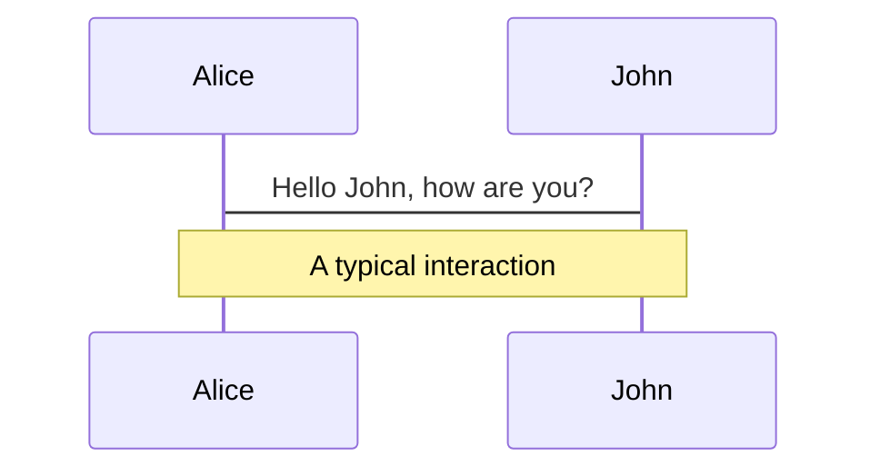
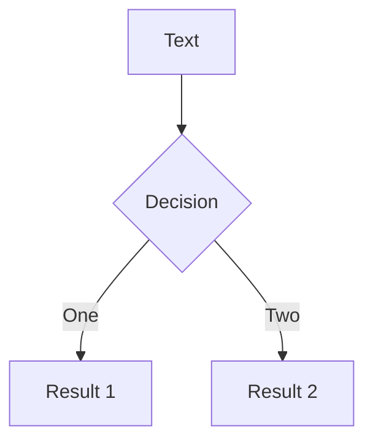
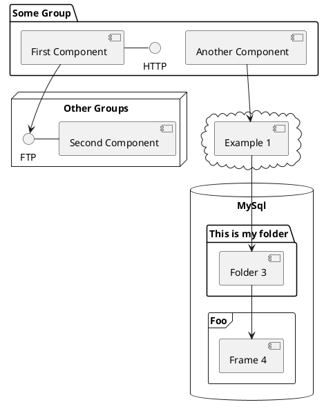

---
# try also 'default' to start simple
theme: seriph
# random image from a curated Unsplash collection by Anthony
# like them? see https://unsplash.com/collections/94734566/slidev
background: https://source.unsplash.com/collection/94734566/1920x1080
# apply any windi css classes to the current slide
class: 'text-center'
# https://sli.dev/custom/highlighters.html
highlighter: shiki
# show line numbers in code blocks
lineNumbers: false
# some information about the slides, markdown enabled
info: |
  ## Slidev Starter Template
  Presentation slides for developers.

  Learn more at [Sli.dev](https://sli.dev)
# persist drawings in exports and build
drawings:
  persist: false
# use UnoCSS (experimental)
css: unocss
---

# 前端项目分享介绍

2022.7.22

<div class="pt-12">
  <span @click="$slidev.nav.next" class="px-2 py-1 rounded cursor-pointer" hover="bg-white bg-opacity-10">
    现在开始！ <carbon:arrow-right class="inline"/>
  </span>
</div>

<div class="abs-br m-6 flex gap-2">
  <a href="https://codeup.aliyun.com/" target="_blank" alt="codeup"
    class="text-xl icon-btn opacity-50 !border-none !hover:text-white">
    <carbon-logo-github />
  </a>
</div>

<!--
The last comment block of each slide will be treated as slide notes. It will be visible and editable in Presenter Mode along with the slide. [Read more in the docs](https://sli.dev/guide/syntax.html#notes)
-->

---

# 项目维度

从项目的角度来看，目前的工作分为以下几个部分：  

- **网络货运平台** - 主业务

- **平遥粮仓项目** - 仅管理后台，与粮仓里的硬件联动，实现过磅、质检、货品管理等记录功能

- **矿大疫情项目** - 捐赠给中国矿业大学(北京)的一套疫情防疫系统，包括小程序、管理后台及两个校区的7处闸机

- **介休货运通平台** - 疫情期间供给介休市政府部门管理货车司机进出介的系统，包括管理后台、H5

- **路桥独立部署项目** - 网络货运平台-路桥版，但不限于煤炭，前段时间的工作重点

- **灵石项目** - 独立部署的监管平台，SaaS业务集成在方向云中，使用白名单进行区分

- **介休公共服务平台** - 两个小程序

- **平定项目** - 暂时只有一个SaaS首页且未上线

- **大哥补充**


<style>
h1 {
  background-color: #2B90B6;
  background-image: linear-gradient(45deg, #4EC5D4 10%, #146b8c 20%);
  background-size: 100%;
  -webkit-background-clip: text;
  -moz-background-clip: text;
  -webkit-text-fill-color: transparent;
  -moz-text-fill-color: transparent;
}
</style>

---

# 代码维度

从代码的角度来看，有以下项目：  

- **方向云 - SaaS-3.0** - [代码地址](https://codeup.aliyun.com/kcsj/kcsj-web/saas-3.0) &nbsp; [测试环境](http://test.platform.kachexiongdi.com/)
- **运营后台 - data** - [代码地址](https://codeup.aliyun.com/kcsj/kcsj-web/data) &nbsp; [测试环境](http://test.platform.kachexiongdi.com/)
- **开票后台 - invoice-platform** - [代码地址](https://codeup.aliyun.com/kcsj/kcsj-web/invoice-platform) &nbsp; [测试环境](http://test.platform.kachexiongdi.com/)
- **监管后台 - regulatory-platform** - [代码地址](https://codeup.aliyun.com/kcsj/kcsj-web/regulatory-platform) &nbsp; [测试环境](http://test.platform.kachexiongdi.com/)
- **h5部分** - [主业务h5-app](https://codeup.aliyun.com/kcsj/kcsj-web/h5-app?spm=a2cl9.codeup_devops2020_goldlog_organization.0.0.32b97103rkp2eT) &nbsp; [h5静态页面](https://codeup.aliyun.com/kcsj/kcsj-web/web-h5-static?spm=a2cl9.codeup_devops2020_goldlog_organization.0.0.32b97103rkp2eT)
- **矿大疫情项目** - [后台代码地址](https://codeup.aliyun.com/kcsj/kcsj-web/edu?spm=a2cl9.codeup_devops2020_goldlog_organization.0.0.32b971036yHR7K) &nbsp; [小程序代码地址](https://codeup.aliyun.com/kcsj/kcsj-web/min-app?spm=a2cl9.codeup_devops2020_goldlog_organization.0.0.32b971036yHR7K) &nbsp; [测试环境(需VPN)](http://test-kuangda.kachexiongdi.com/)
- **介休货运通平台** - [后台代码地址](https://codeup.aliyun.com/kcsj/kcsj-web/epidemic-control-jx?spm=a2cl9.codeup_devops2020_goldlog_organization.0.0.32b971036yHR7K) &nbsp; [h5代码地址](https://codeup.aliyun.com/kcsj/kcsj-web/epidemic-h5-jx?spm=a2cl9.codeup_devops2020_goldlog_organization.0.0.32b971036yHR7K) &nbsp; [测试环境](http://test-jx-manager.kachexiongdi.com/)
- **路桥独立部署项目** - [代码组地址](https://codeup.aliyun.com/kcsj/kcsj-web-lq) &nbsp; [测试环境-SaaS](http://test-lq-saas-web.sxjtcyy.com/)
- **灵石项目** - [测试环境](https://test-regulatory-ls.kachexiongdi.com/)
- **官网** - [PC官网](https://codeup.aliyun.com/kcsj/kcsj-web/website) &nbsp; [移动官网](https://codeup.aliyun.com/kcsj/kcsj-web/website_h5?spm=a2cl9.codeup_devops2020_goldlog_organization.0.0.32b97103rkp2eT)
- **磁窑沟SaaS** - 稳定运行基本不作维护及升级

<br />

[访问测试同事维护的文档获取测试地址及测试账号](https://fangxiang-tech.feishu.cn/docs/doccnwFlV9wzhRu5uAB7QNBb9cP)

<style>
h1 {
  background-color: #2B90B6;
  background-image: linear-gradient(45deg, #4EC5D4 10%, #146b8c 20%);
  background-size: 100%;
  -webkit-background-clip: text;
  -moz-background-clip: text;
  -webkit-text-fill-color: transparent;
  -moz-text-fill-color: transparent;
}
</style>

---

# 开发中  

<br />
<br />

- **Web组件库** - 使用dumi框架对antd二次封装 &nbsp; [代码地址](https://codeup.aliyun.com/kcsj/kcsj-web-base/web-components?spm=a2cl9.codeup_devops2020_goldlog_organization.0.0.32b97103rkp2eT) &nbsp; [组件库使用](https://packages.aliyun.com/npm/npm-registry/artifacts)


<br />

- **权限系统** - 大哥在进行开发的一套集租户、用户权限、菜单控制、子账号等功能在内的服务

<br />

- **开票平台2.0** - 飞冰框架进行重构，使用私有组件库替代antd，并使用上述权限系统控制。

<style>
h1 {
  background-color: #2B90B6;
  background-image: linear-gradient(45deg, #4EC5D4 10%, #146b8c 20%);
  background-size: 100%;
  -webkit-background-clip: text;
  -moz-background-clip: text;
  -webkit-text-fill-color: transparent;
  -moz-text-fill-color: transparent;
}
</style>

---

# What is Slidev?

Slidev is a slides maker and presenter designed for developers, consist of the following features

- 📝 **Text-based** - focus on the content with Markdown, and then style them later
- 🎨 **Themable** - theme can be shared and used with npm packages
- 🧑‍💻 **Developer Friendly** - code highlighting, live coding with autocompletion
- 🤹 **Interactive** - embedding Vue components to enhance your expressions
- 🎥 **Recording** - built-in recording and camera view
- 📤 **Portable** - export into PDF, PNGs, or even a hostable SPA
- 🛠 **Hackable** - anything possible on a webpage

<br>
<br>

Read more about [Why Slidev?](https://sli.dev/guide/why)

<!--
You can have `style` tag in markdown to override the style for the current page.
Learn more: https://sli.dev/guide/syntax#embedded-styles
-->

<style>
h1 {
  background-color: #2B90B6;
  background-image: linear-gradient(45deg, #4EC5D4 10%, #146b8c 20%);
  background-size: 100%;
  -webkit-background-clip: text;
  -moz-background-clip: text;
  -webkit-text-fill-color: transparent;
  -moz-text-fill-color: transparent;
}
</style>

---

# Navigation

Hover on the bottom-left corner to see the navigation's controls panel, [learn more](https://sli.dev/guide/navigation.html)

### Keyboard Shortcuts

|     |     |
| --- | --- |
| <kbd>right</kbd> / <kbd>space</kbd>| next animation or slide |
| <kbd>left</kbd>  / <kbd>shift</kbd><kbd>space</kbd> | previous animation or slide |
| <kbd>up</kbd> | previous slide |
| <kbd>down</kbd> | next slide |

<!-- https://sli.dev/guide/animations.html#click-animations -->

<p v-after class="absolute bottom-23 left-45 opacity-30 transform -rotate-10">Here!</p>

---
layout: image-right
image: https://source.unsplash.com/collection/94734566/1920x1080
---

# Code

Use code snippets and get the highlighting directly![^1]

```ts {all|2|1-6|9|all}
interface User {
  id: number
  firstName: string
  lastName: string
  role: string
}

function updateUser(id: number, update: User) {
  const user = getUser(id)
  const newUser = { ...user, ...update }
  saveUser(id, newUser)
}
```

<arrow v-click="3" x1="400" y1="420" x2="230" y2="330" color="#564" width="3" arrowSize="1" />

[^1]: [Learn More](https://sli.dev/guide/syntax.html#line-highlighting)

<style>
.footnotes-sep {
  @apply mt-20 opacity-10;
}
.footnotes {
  @apply text-sm opacity-75;
}
.footnote-backref {
  display: none;
}
</style>

---

# Components

<div grid="~ cols-2 gap-4">
<div>

You can use Vue components directly inside your slides.

We have provided a few built-in components like `<Tweet/>` and `<Youtube/>` that you can use directly. And adding your custom components is also super easy.

```html
<Counter :count="10" />
```

<!-- ./components/Counter.vue -->
<Counter :count="10" m="t-4" />

Check out [the guides](https://sli.dev/builtin/components.html) for more.

</div>
<div>

```html
<Tweet id="1390115482657726468" />
```

<Tweet id="1390115482657726468" scale="0.65" />

</div>
</div>


---
class: px-20
---

# Themes

Slidev comes with powerful theming support. Themes can provide styles, layouts, components, or even configurations for tools. Switching between themes by just **one edit** in your frontmatter:

<div grid="~ cols-2 gap-2" m="-t-2">

```yaml
---
theme: default
---
```

```yaml
---
theme: seriph
---
```


</div>

Read more about [How to use a theme](https://sli.dev/themes/use.html) and
check out the [Awesome Themes Gallery](https://sli.dev/themes/gallery.html).

---
preload: false
---

# Animations

Animations are powered by [@vueuse/motion](https://motion.vueuse.org/).

```html
<div
  v-motion
  :initial="{ x: -80 }"
  :enter="{ x: 0 }">
  Slidev
</div>
```

<div class="w-60 relative mt-6">
  <div class="relative w-40 h-40">
    
    
    
  </div>

  <div
    class="text-5xl absolute top-14 left-40 text-[#2B90B6] -z-1"
    v-motion
    :initial="{ x: -80, opacity: 0}"
    :enter="{ x: 0, opacity: 1, transition: { delay: 2000, duration: 1000 } }">
    Slidev
  </div>
</div>

<!-- vue script setup scripts can be directly used in markdown, and will only affects current page -->
<script setup lang="ts">
const final = {
  x: 0,
  y: 0,
  rotate: 0,
  scale: 1,
  transition: {
    type: 'spring',
    damping: 10,
    stiffness: 20,
    mass: 2
  }
}
</script>

<div
  v-motion
  :initial="{ x:35, y: 40, opacity: 0}"
  :enter="{ y: 0, opacity: 1, transition: { delay: 3500 } }">

[Learn More](https://sli.dev/guide/animations.html#motion)

</div>

---

# LaTeX

LaTeX is supported out-of-box powered by [KaTeX](https://katex.org/).

<br>

Inline $\sqrt{3x-1}+(1+x)^2$

Block
$$
\begin{array}{c}

\nabla \times \vec{\mathbf{B}} -\, \frac1c\, \frac{\partial\vec{\mathbf{E}}}{\partial t} &
= \frac{4\pi}{c}\vec{\mathbf{j}}    \nabla \cdot \vec{\mathbf{E}} & = 4 \pi \rho \\

\nabla \times \vec{\mathbf{E}}\, +\, \frac1c\, \frac{\partial\vec{\mathbf{B}}}{\partial t} & = \vec{\mathbf{0}} \\

\nabla \cdot \vec{\mathbf{B}} & = 0

\end{array}
$$

<br>

[Learn more](https://sli.dev/guide/syntax#latex)

---

# Diagrams

You can create diagrams / graphs from textual descriptions, directly in your Markdown.

<div class="grid grid-cols-3 gap-10 pt-4 -mb-6">







</div>

[Learn More](https://sli.dev/guide/syntax.html#diagrams)


---
layout: center
class: text-center
---

# Learn More

[Documentations](https://sli.dev) · [GitHub](https://github.com/slidevjs/slidev) · [Showcases](https://sli.dev/showcases.html)
